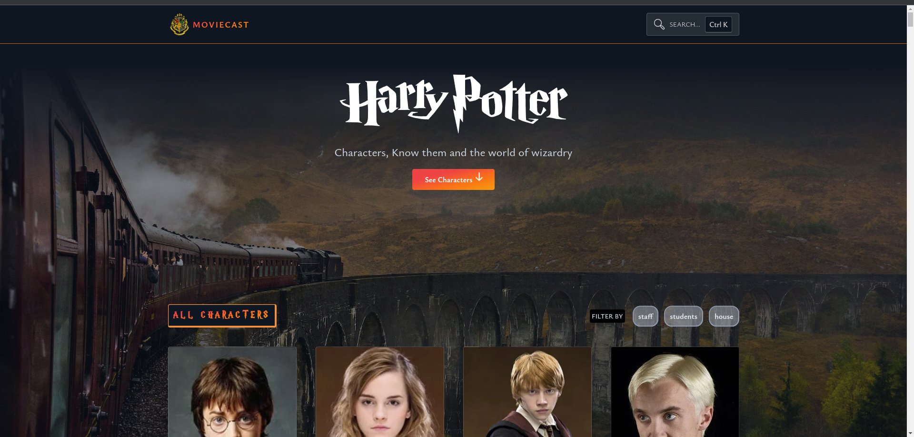
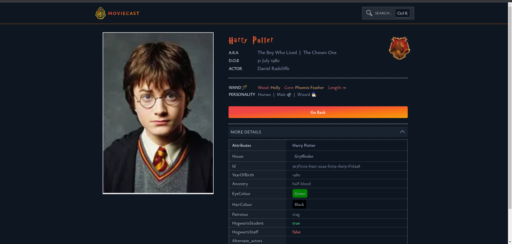
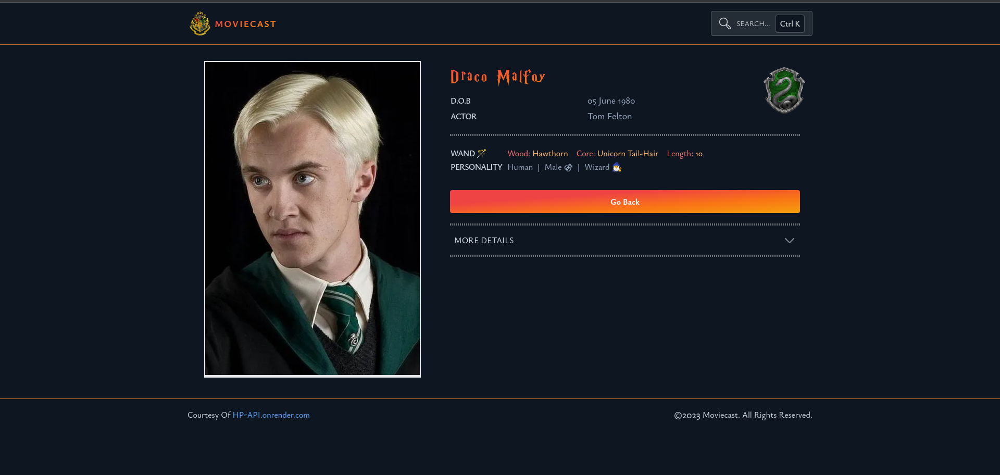
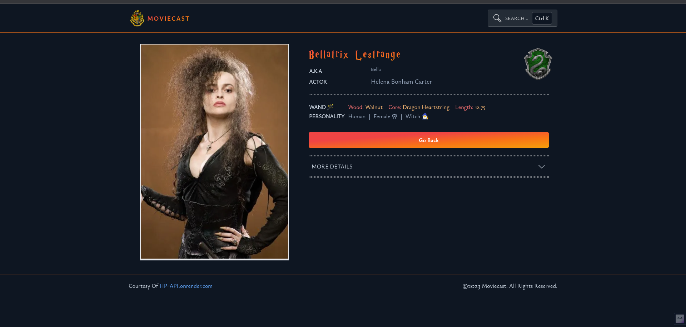
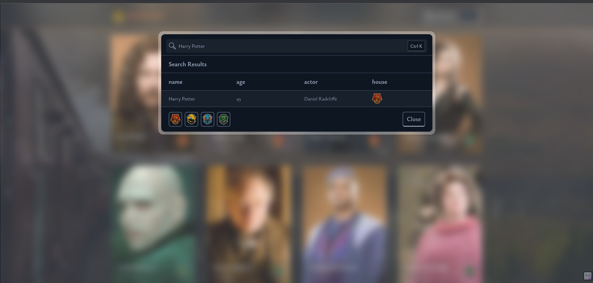
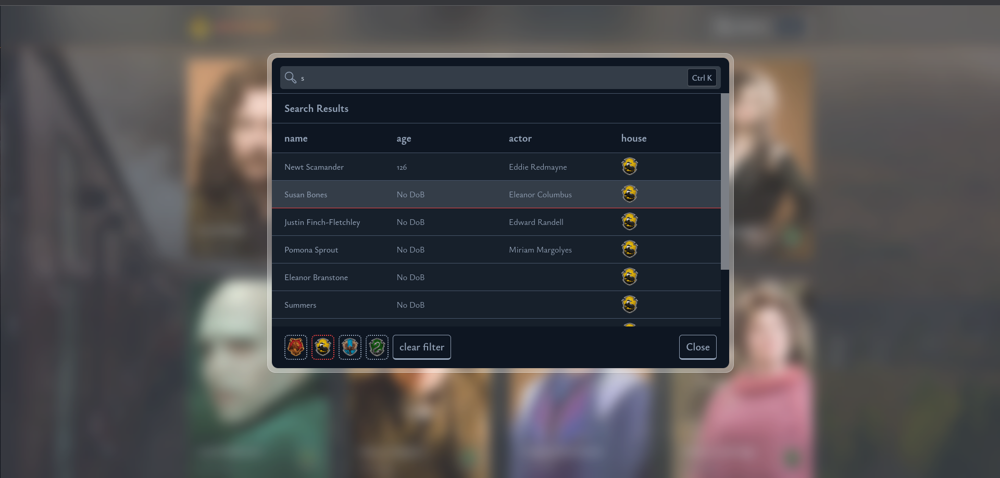
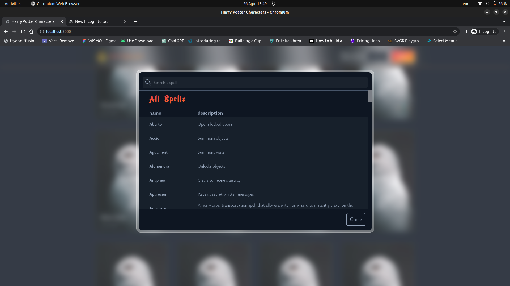

# [Harry potter cast website](https://pottercast.vercel.app/)

Fandom website listing all the characters in the [Harry Potter Franchise](https://www.imdb.com/title/tt0241527/) and their characteristics. This is courtesy to the [HP-API](https://hp-api.onrender.com/).

<!-- prettier-ignore-start -->
<!-- [![Build Status][build-badge]][build]
[![Code Coverage][coverage-badge]][coverage] -->
<!-- [![version][version-badge]][package] -->
<!-- [![downloads][downloads-badge]][npmtrends]
[![Apache License][license-badge]][license] -->
<!-- [![All Contributors][all-contributors-badge]](#contributors) -->
<!-- [![PRs Welcome][prs-badge]][prs]
[![Code of Conduct][coc-badge]][coc] -->
<!-- [![Discord][discord-badge]][discord] -->
<!-- [![Watch on GitHub][github-watch-badge]][github-watch]
[![Star on GitHub][github-star-badge]][github-star] -->
<!-- [![Tweet][twitter-badge]][twitter] -->
<!-- prettier-ignore-end -->

<!-- todo add screenshots and also link to the website -->

# Project Name

Welcome to the Project Name repository! This repository contains information about the home, character, and search functionalities of the project.

## Home Page

The home page shows all the character with option to filter them based on houses , student or staff. It provides an overview of the project's features and options.




## Character

The character section showcases different characters of harry potter movie. Each character has a unique role and more interesting facts 🤓

### Character Pages







## Search

The search functionality allows users to quickly find what they are looking for within the page also with some filters.




## Spells

Spells from harry potter. i.e _Wingardium Leviosa 🪶_



## Usage

To use the project, follow these steps:

1. Clone the repository: `git clone https://github.com/yourusername/project-name.git`
2. Navigate to the project directory: `cd project-name`
3. Open the necessary files for each functionality.

<!-- steps to run application locally -->

## steps to run application locally

- clone the repository

```
git clone https://github.com/edcheyjr/harry-potter
```

- cd to the repo run npm install on the repository directory

```
cd harry-potter
npm install
```

- follow the instructions below to by nextjs **Getting Started**

## What is Nextjs powering this site

This is a [Next.js](https://nextjs.org/) project bootstrapped with [`create-next-app`](https://github.com/vercel/next.js/tree/canary/packages/create-next-app).

## Getting Started

First, run the development server:

```bash
npm run dev
# or
yarn dev
# or
pnpm dev
```

Open [http://localhost:3000](http://localhost:3000) with your browser to see the result.

## Credits

Special thanks to [edcheyjr](https://github.com/edcheyjr) the owner to the project.

## License

This project is licensed under the [Apache License](LICENSE).

## Deployed on Vercel

The easiest way to deploy your Next.js app is to use the [Vercel Platform](https://vercel.com/new?utm_medium=default-template&filter=next.js&utm_source=create-next-app&utm_campaign=create-next-app-readme) from the creators of Next.js.

Check out [Next.js deployment documentation](https://nextjs.org/docs/deployment) for more details.
